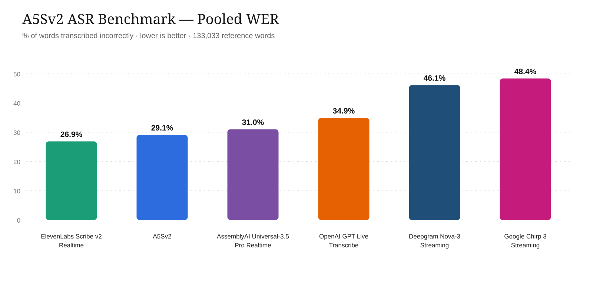
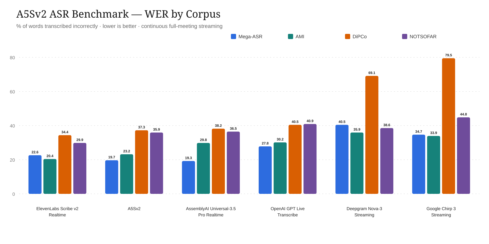

# A5Sv2 ASR benchmark

Reproducible streaming ASR evaluation on four public English corpora. Each corpus contributes
about 33k normalized reference words. The primary aggregate is the unweighted mean of the four
trial-1 corpus WERs; pooled WER is also reported. No multi-trial averaging is used.

**Dataset:** [`AirCaps/a5sv2-asr-benchmark-dataset`](https://huggingface.co/datasets/AirCaps/a5sv2-asr-benchmark-dataset)

| Corpus | Fixed selection | Audio | Reference words |
|---|---|---|---:|
| [Mega-ASR / Voices-in-the-Wild-2M](https://huggingface.co/datasets/zhifeixie/Voices-in-the-Wild-2M) | 1,250 utterances; 250 per condition | stored mono utterances | 32,928 |
| [AMI](https://groups.inf.ed.ac.uk/ami/corpus/) | [7 scenario-only unseen-evaluation meetings](https://huggingface.co/datasets/AirCaps/a5sv2-asr-benchmark-dataset/blob/main/results/four-corpus-v1/references/meetings.jsonl.gz) | `Array1-01`, 0 dB | 32,928 |
| [DiPCo](https://arxiv.org/abs/1909.13447) | [5 eval meetings + 1 dev meeting](https://huggingface.co/datasets/AirCaps/a5sv2-asr-benchmark-dataset/blob/main/results/four-corpus-v1/references/meetings.jsonl.gz) | `U01.CH1`, +5.1 dB | 33,681 |
| [NOTSOFAR](https://www.isca-archive.org/interspeech_2024/vinnikov24_interspeech.html) | [22 eval-small meetings](https://huggingface.co/datasets/AirCaps/a5sv2-asr-benchmark-dataset/blob/main/results/four-corpus-v1/references/meetings.jsonl.gz) | `sc_meetup_0/ch0.wav`, 0 dB | 33,496 |

### Mega-ASR disclosure

We sampled from **Mega-ASR-Train**, rather than the standard Mega-ASR test set, because in our
experiments the standard test set was not acoustically challenging enough to clearly discriminate
among robust ASR systems. This is a derived evaluation set; it should not be mixed into training
when reporting results on it.

A5Sv2 was not trained or fine-tuned on these 1,250 selected recordings or transcripts, and they
were not used for checkpoint selection, hyperparameter tuning, prompt tuning, or any other
model-selection decision. We cannot determine whether third-party systems were trained on these
items or overlapping upstream data. This is an exact-item disclosure, not a claim of
distribution-level independence: the subset comes from a public training split and may resemble
data used to develop any evaluated system. Mega-ASR results should therefore be interpreted as a
developer-created robustness diagnostic alongside the three meeting corpora.

The exact IDs, revisions, selection rules, reference parsing, audio handling, and API requests are
specified in [`PROTOCOL.md`](PROTOCOL.md).

## Results

Corpus WER (%), lower is better. Every value uses saved trial 1 for every system and corpus; no
headline value is a multi-trial mean. Each meeting is one complete, continuous stream. All 1,285
reference items succeeded for every listed system.

| System | Mega-ASR | AMI | DiPCo | NOTSOFAR | Macro | Pooled |
|---|---:|---:|---:|---:|---:|---:|
| ElevenLabs Scribe v2 Realtime | 22.643343 | **20.411200** | **34.396247** | **29.854311** | **26.826275** | **26.882052** |
| A5Sv2 | 19.682337 | 23.202138 | 37.261364 | 35.932649 | 29.019622 | 29.095788 |
| AssemblyAI Universal-3.5 Pro Realtime | **19.254130** | 29.831754 | 38.187702 | 36.475997 | 30.937396 | 31.002082 |
| OpenAI GPT Live Transcribe | 27.812196 | 30.159742 | 40.456043 | 40.924289 | 34.838068 | 34.895853 |
| Deepgram Nova-3 Streaming | 40.457969 | 35.945092 | 69.127995 | 38.550872 | 46.020482 | 46.119384 |
| Google Chirp 3 Streaming | 34.675656 | 33.928571 | 79.466168 | 44.829233 | 48.224907 | 48.387242 |





Machine-readable scores are in [`results/`](results). Raw references, predictions, run metadata,
and SHA-256 checksums are published in the
[`AirCaps/a5sv2-asr-benchmark-dataset`](https://huggingface.co/datasets/AirCaps/a5sv2-asr-benchmark-dataset)
Hugging Face dataset. A5Sv2 inference code is not published, but its raw predictions are provided
so every score can be reproduced independently.

This release reports point estimates only; confidence intervals are not reported.

## Quickstart

```bash
python -m venv .venv
source .venv/bin/activate
python -m pip install -e ".[api]"
python -m a5sv2_eval.prepare mega meetings
```

Copy `.env.example` to `.env`, add credentials, and stream the saved manifests. Audio is paced in
real time; concurrency changes wall time only.

```bash
set -a; source .env; set +a
python -m a5sv2_eval.run_all deepgram assemblyai google openai elevenlabs \
  --manifest benchmark_data/mega/manifest.jsonl \
  --output-dir benchmark_data/results --trials 1
python -m a5sv2_eval.run_all deepgram assemblyai google openai elevenlabs \
  --manifest benchmark_data/meetings/manifest.jsonl \
  --output-dir benchmark_data/meetings/results --trials 1 --concurrency 8
python -m a5sv2_eval.score \
  benchmark_data/results/*.jsonl benchmark_data/meetings/results/*.jsonl
```

Google uses deterministic five-minute session rollover for full meetings. GPT Live Transcribe
requires deterministic conversion to 24 kHz PCM16. Both choices are fully recorded in result rows
and documented in [`PROTOCOL.md`](PROTOCOL.md). Use `--limit 2 --trials 1` on an individual
provider module for a paid smoke test.

## License

Apache-2.0. Provider APIs and source corpora remain subject to their own terms and licenses.
